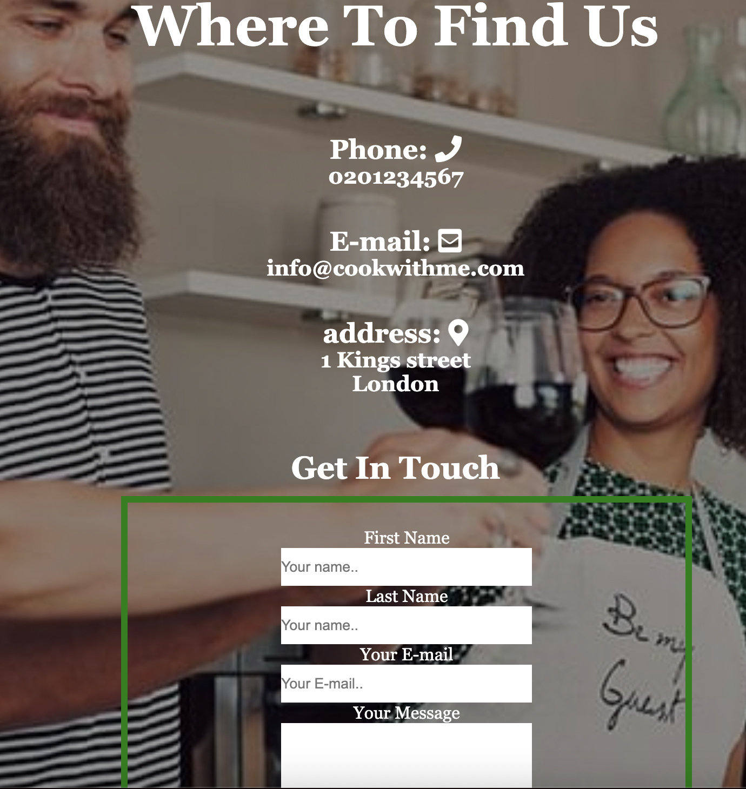

# Cook With Me (My very First Project)
The Idea came into my mind as I Enjoy cooking and Enjoy browsing cooking website, As it is my first project , I used simple design to be easy to read and browse.
It gives the broweser an idea of what is this school for , what type of cooking classes it provides and the way how to contact or reach it.

## Exixting Features 
### Navigation Bar
Navigation bar, it includes link to the Logo, About us, Classes and contact to allow  the user to easy navigation from page to page across many devices.

### The Landing Page Image and About us Section
The Landing page with paragraph, to Allow the user know what the school about and the reason to join it.

## Classes Section
The Classes Section allows the user to view the vareity classes to book with the date and time that supported  with attaractive images that provides the user how the result will look like .

## Contact Section
Contact section allows the user to find the location and reach the school easly ,as well the way to get intouch or to register with Cook With Me School by provide the first/last name and email of the user.
The Section has as well a background image of how the atmosphere of the class will look like .

## Features Left to Implement 
In future , more sections will be added for such a project , like Shopping Section .
 
More classes , plus an online classes would be helpfull as well, especially with Covid time .
Would like to add voucher to encourage the user for  booking more classes.

# Testing
* HTML
 
  index.html ,no errors were found when passing through the official [W3C Validator](https://validator.w3.org/)

